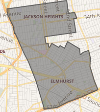

<meta name="robots" content="noindex">

# Temporary/Draft policy site

+ **Make our district's one vote in city council count**
+ Primary election: June 22nd
+ Vote: Mubtasim Shawon for city council district 25

Policy summery:

+ Advocate for evidence based policies
+ Primary focus on safety and increase in economic dynamism and demand
+ Reduce tax burden on low and middle class
+ Responsible and community oriented budgeting
+ Verifiable representative accountability

Policy explanation:

+ Fund our police and invest in better training
    + NYPD was defunded by $1 Billion dollar in last budget as crime increased in our community
    + Latest NYPD report (2/22/2021 Through 2/28/2021) shows:
        + In 110 precinct there's a 60% increase in rape, 87.5% increase in Burglary and 162.5% increase in car theft compared to 2 years ago
        + In 115th precinct there's a 33% increase in rape, 32% increase in robbery and 86.7% increase in car theft
+ Reorient city council towards quantified policy
    + Require each resolution to include clearly defined goal and a falsifiable claim to assess success and contingency of the decision
    + Require council to fund study to detail and publish HDL (Human Developmental Index) to public periodically to better prioritize improvement efforts
+ Receive summery and rational before each vote and decision in city council to keep your representative accountable and have your voices heard on issues that matter to you
+ Community approved devolvements and re-zoning
    + Gains get reinvested in the same community
    + Let neighbors decide the cost/benefit in a fast and timely manner
+ City funded micro community space
    + Local meeting space, rented and paid for by city govt
+ Expand immigrant integration program
    + Increase time availability and enrollment options for free english and computer classes and connect people to local jobs and internship with local business tax incentive
+ Remove general sales tax, increase [bank tax](https://www1.nyc.gov/nycbusiness/description/banking-corporation-tax)
+ Introduce targeted sales tax on luxury items
    + Increase sales tax on alcohol
    + Increase sales tax on junk food
+ Remove street parking near busy intersections like 37 ave  and 74th st
+ Make it easier to report noise and air pollution
+ Increase fund and improve Elmhurst hospital and other govt customer service
+ Advocate for smart city policies
    + [Increase street lights to reduce crime](https://link.springer.com/article/10.1007/s10940-020-09490-6)
    + Parking spot sensor technology to reduce traffic and save time

-----

_Campaign committee: Shawon 2021_

<style>
h1:first-of-type:not([id]) { display: none; }
<style>
